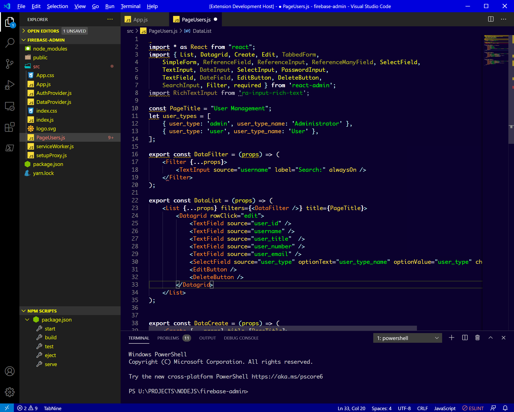
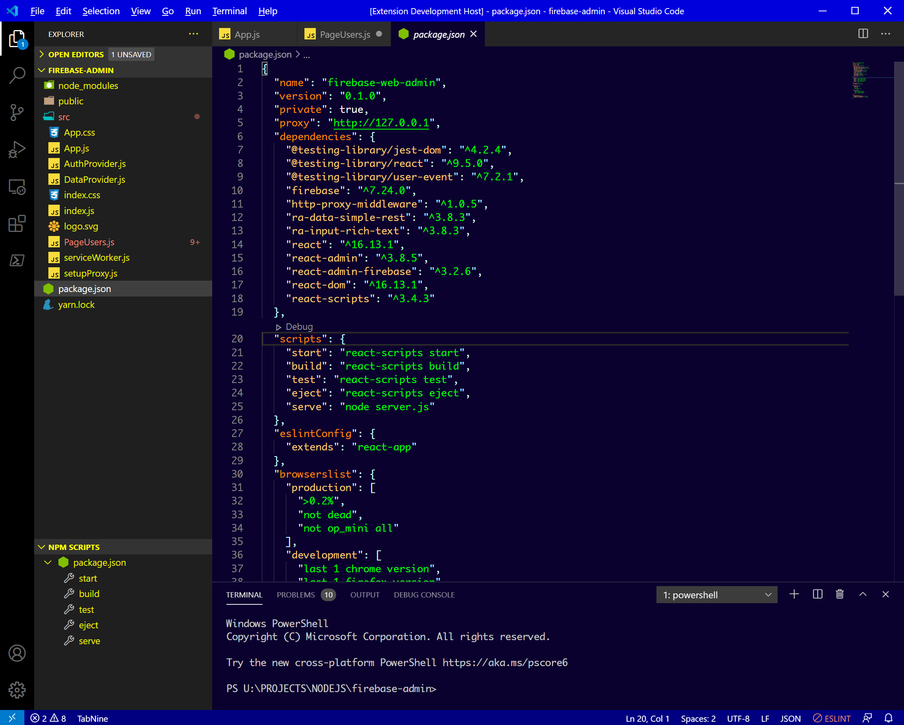
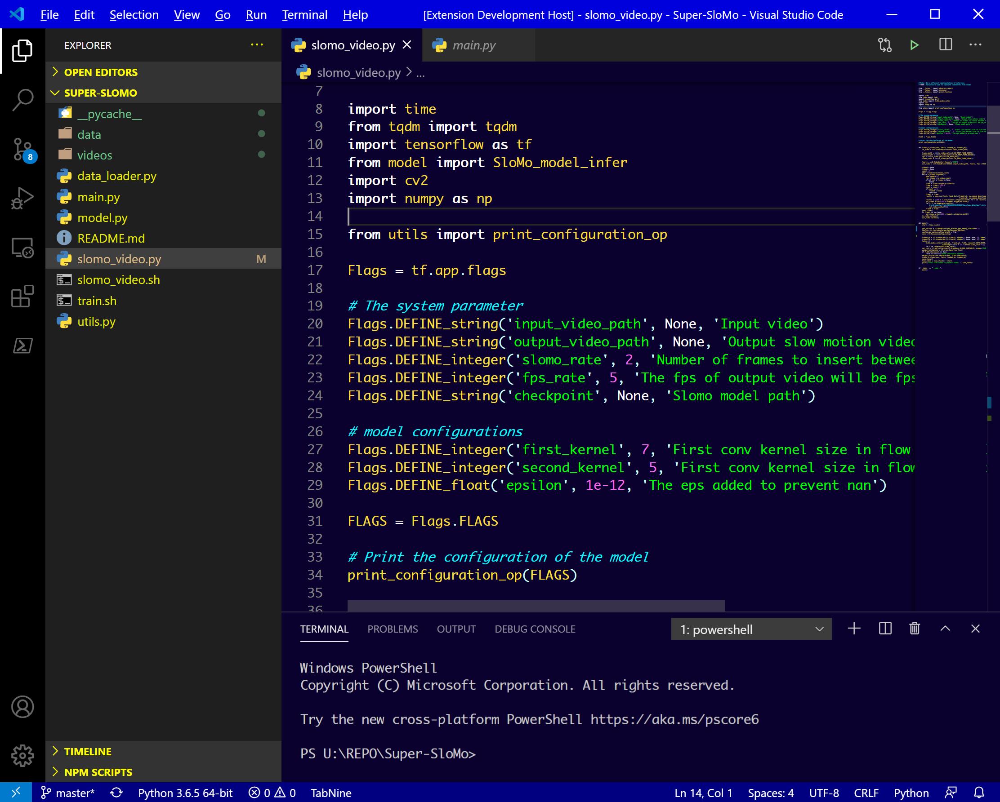
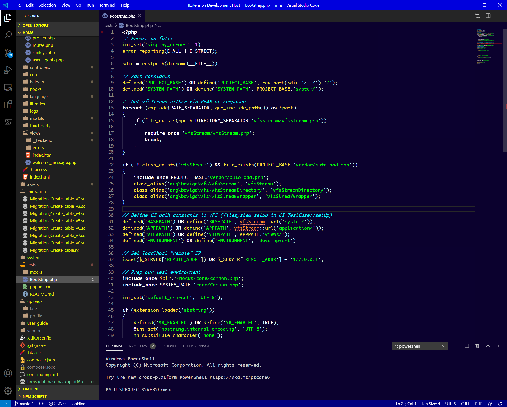
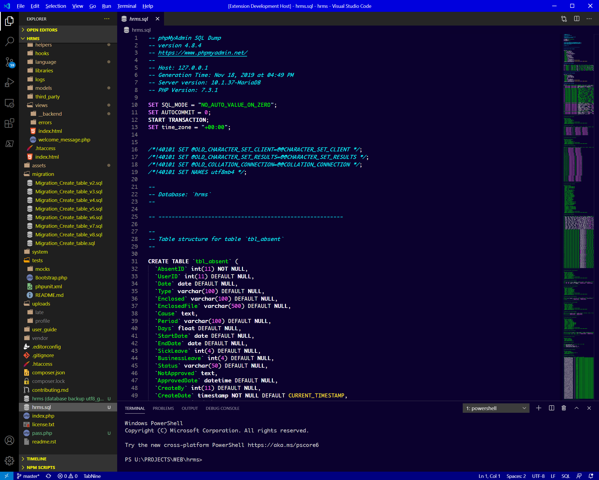

# TURBO THEME release 1
## inspired from Turbo Editor since 1987
You can author your README using Visual Studio Code.  Here are some useful editor keyboard shortcuts:

## Screenshot
Screenshot of JavaScript, PHP, Python, HTML








## Install

press `ctl/command + shift + p` to launch the command palette then run
```
ext install theme-turbo
```

## Auhor
by iMakeProject

**Enjoy!**
